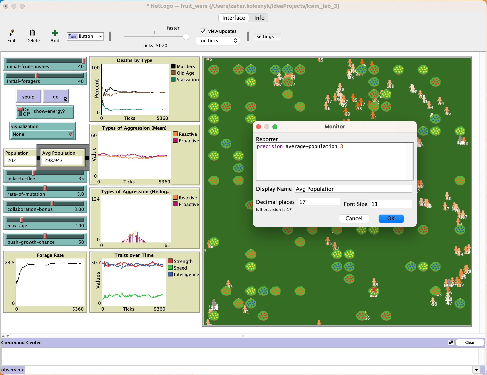
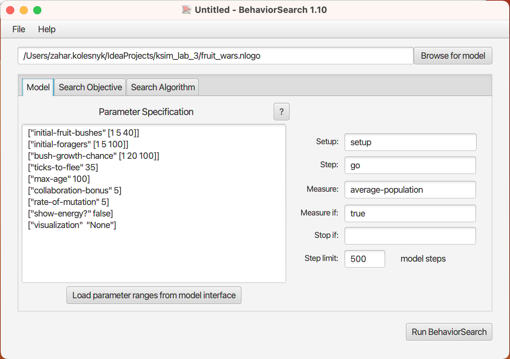
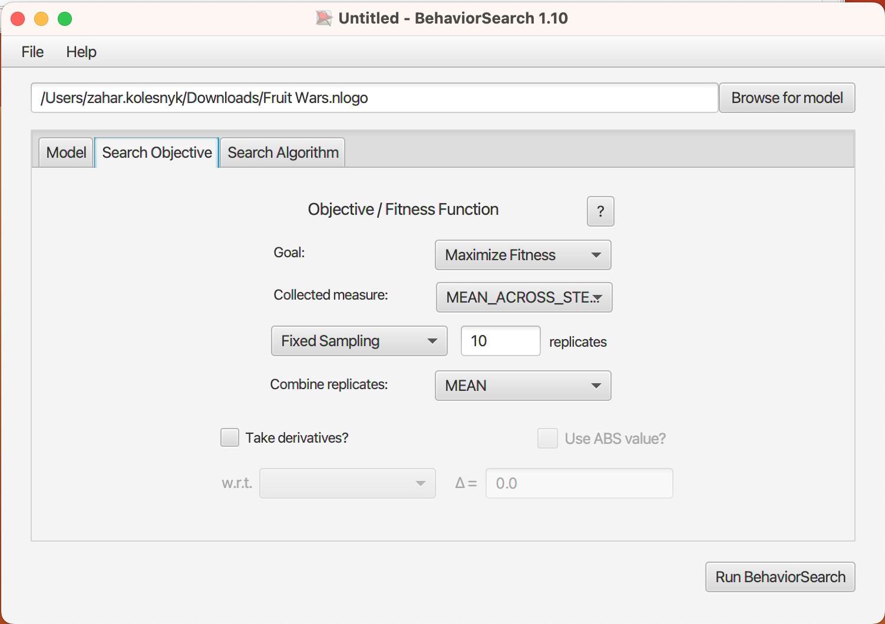
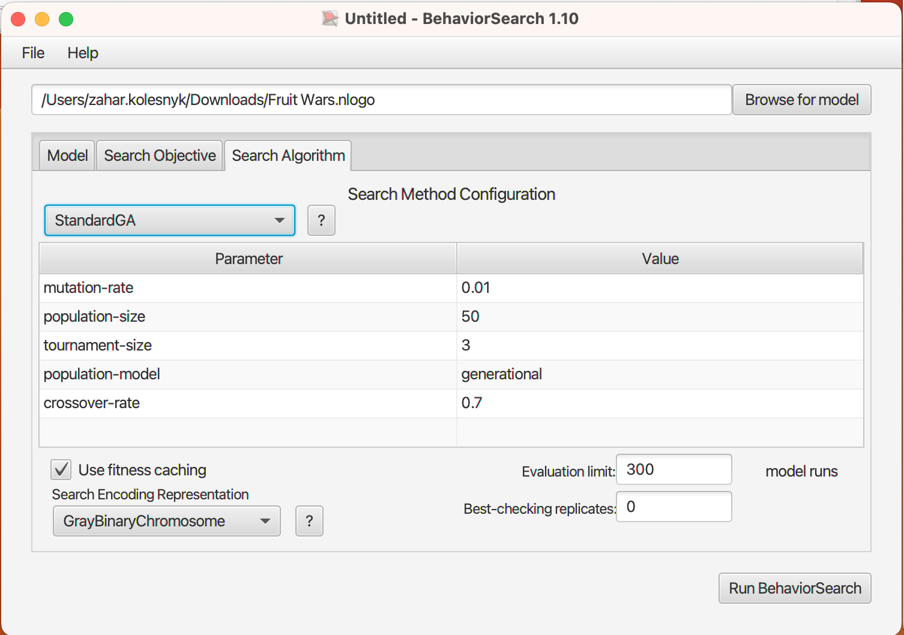
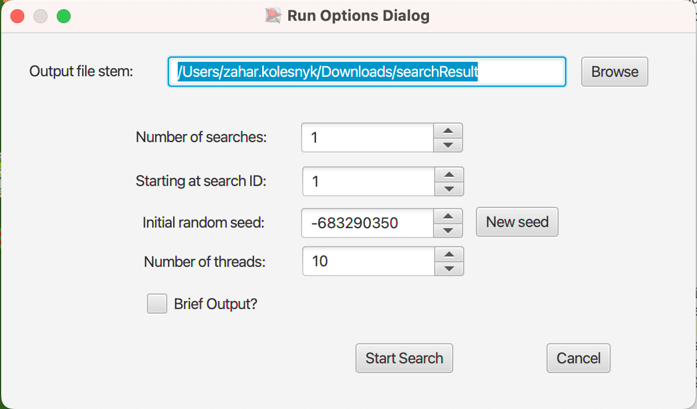
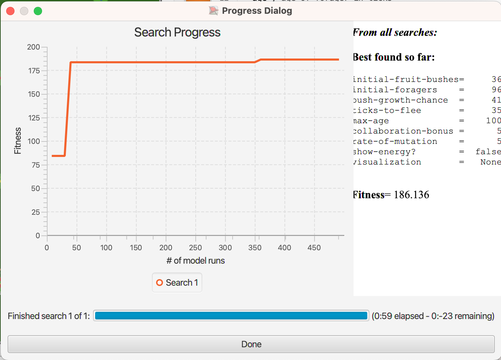
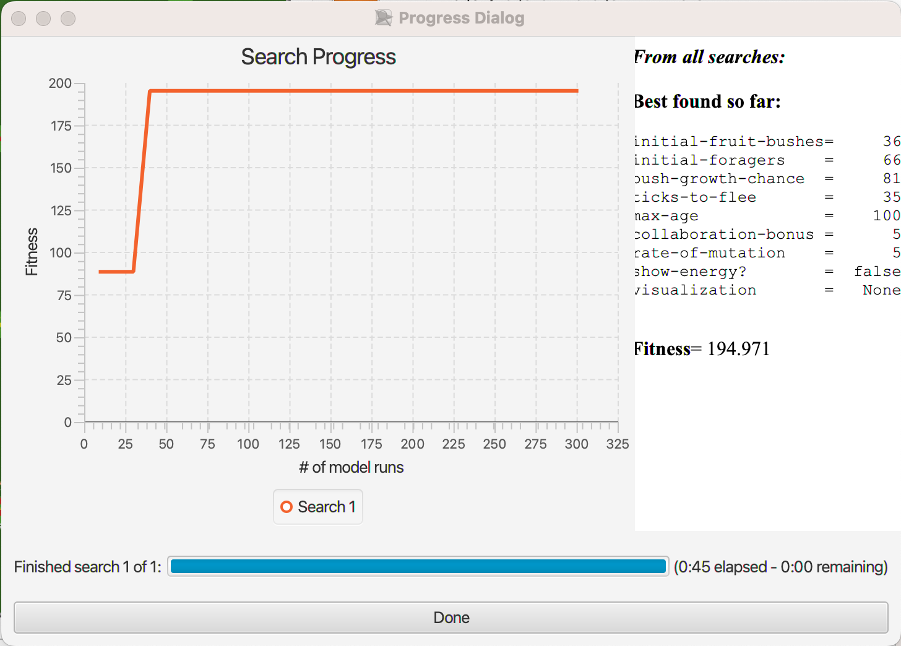

## Комп'ютерні системи імітаційного моделювання
## СПм-22-5, **Колесник Захар Володимирович**
### Лабораторна робота №**3**. Використання засобів обчислювального интелекту для оптимізації імітаційних моделей

 

### Варіант 13, модель у середовищі NetLogo:
[Fruit Wars](http://www.netlogoweb.org/launch#http://www.netlogoweb.org/assets/modelslib/Sample%20Models/Social%20Science/Economics/Fruit%20Wars.nlogo).

 

#### Вербальний опис моделі:
Симуляція боротьби за обмежені ресурси у різних групах людської популяці. Кожен збирач дотримується набору правил:
- рухатись випадково якщо поблизу нема кущів
- якщо поблизу є кущ, рухатись у його напрямку споживаючи 1 одиницю енергії
- якщо біля куща є інші сбирачі, прибуваючий сбирач може загрожувати або співпрацювати ймовірнісно на основі свого значення реактивної агресії.
- якщо кущ поблизу проводити збір (споживати енергію)
- якщо енергія куща закінчуеється кущ вмирає та усі збирачі поруч переходять до статусу пошук
- якщо енергія збирача більше 200, то розмножуватяь витрачаючи 100 одиниць енергії
- якщо закинилась енергія або вік збирача вище за параметр **max-age** збирач вмирає

#### Початкові параметри:
- **initial-fruit-bushes** визначає килькість кущів з початку
- **initial-foragers** визначає килькість збирачів з початку

#### Параметри візуалізаціі:
- **show-energy** відображає поточну енергію кожного окремого сбирача на екрані, якщо ця функція активована.
- **visualisation** масштабує колір агента в залежності від значення вибраного параметра, де світлі кольори відображають вищі значення цього параметра.

#### Керуючі параметри:
- **ticks-to-flee** кількість тактів пересування збірника фруктів перш ніж він почне поук кущів.
- **rate-of-mutation** верогідність зміни біта у геномі при передачі його до потомства.
- **collaboration-bonus** фактор співпраці, підвищує швидкість сбору поживи для кількох сбирачів біля одного куща.
- **max-age** максимальна кількість тактів, протягом яких окремий сбирач може жити, коли цей ліміт досягається, сбирач помертає.
- **bush-grow-chance** визначає вирогідність появи нового фруктового куща на кожному такті.

#### Показники роботи моделі:
- смертність серед сбирачів та розподіл смертей за причинами.
- реактивна/проактивна агресія
- динаміка характеристик збирачів.
- динаміка населення.
- кількість випадків насильства у системі.
- рейтинг збирання

 

### Налаштування середовища BehaviorSearch:

**Обрана модель**:
[Fruit Wars](http://www.netlogoweb.org/launch#http://www.netlogoweb.org/assets/modelslib/Sample%20Models/Social%20Science/Economics/Fruit%20Wars.nlogo).

**Параметри моделі**:  
Автоматично вилучені параметри середовищем BehaviorSearch із вибраної імітаційної моделі, були підкореговані:
<pre>
["initial-fruit-bushes" [1 5 40]]
["initial-foragers" [1 5 100]]
["bush-growth-chance" [1 20 100]]
["ticks-to-flee" 35]
["max-age" 100]
["collaboration-bonus" 5]
["rate-of-mutation" 5]
["show-energy?" false]
["visualization"  "None"]
</pre>

Проведені зміни:
- Нижчу межу діапазону початкової кількісті кущів було підвищено до 5
- Нижчу межу діапазону початкової кількісті збирачів було підвищено до 5
- Нижчу межу діапазону початкової верогідності появи кущів було  до 20
- Кількість тактів пересування збірника фруктів перш ніж він почне поук кущів було встановлено константою 35
- Максимальну кількість тактів, протягом яких окремий сбирач може жити було встановлено константою 100
- Було встановлено максимальний бонус співпраці
- Була встановлена 50% верогідність мутаціі
- Показ енергіі та візуалізація були вімкнені щоб зменшити навантаженість, так як не впливают на розрахунки

 
Використовувана **міра**:  
Було обрано **значення середньої популяціі**, ім'я змінної для її розрахунку взято з налаштувань графіка аналізованої імітаційної моделі в середовищі NetLogo та вказано у параметрі "**Measure**": `average-population`  

Середня кількість населення повинна враховуватися **в середньому** за весь період симуляції тривалістю 500 тактів.  
*Параметр "**Mesure if**" залишив зі значенням `true`, тож враховуватимуться всі такти симуляції.  
Параметри "**Setup**" та "**Go**" не змінював так як вони вказують відповідні процедури ініціалізації що співпадає з іменами процедур моєї моделі.*  
Параметр зупинки за умовою ("**Stop if**") не використовувався.  
Загальний вигляд вкладки налаштувань параметрів моделі:  

**Налаштування цільової функції**:  
Метою підбору параметрів імітаційної моделі, що описує cимуляцію боротьби за обмежені ресурси, є **максимізація** середнього значення населення – це вказано через параметр "**Goal**" зі значенням **Maximize Fitness**. 
Ведеться пошук параметрів налаштувань моделі, за яких середнє значення середньго значення населення за всю симуляцію (500 кроків) буде максимальним. Для цього у параметрі "**Collected measure**", що визначає спосіб обліку значень обраного показника, вказано **MEAN_ACROSS_STEPS**.  
Задля уникнення викривлення результатів через випадкові значення, **кожна симуляція повторюється по 10 разів**, результуюче значення розраховується як **середнє арифметичне**.  
Загальний вигляд вкладки налаштувань цільової функції:  

**Налаштування алгоритму пошуку**:  
На цьому етапі було визначено модель, налаштовано її параметри, і обрано міру, що лежить в основі функції пристосованості, що дозволяє оцінити якість кожного перевіряємого BehaviorSearch варіантів рішення.  
У ході дослідження на лабораторній роботі використовуються два алгоритми: Випадковий пошук(**RandomSearch**) і Простий генетичний алгоритм (**StandardGA**).  
Для цих алгоритмів, що вирішують завдання пошуку такого набору параметрів імітаційної моделі, щоб задовольнити вимоги користувача (у нашому випадку – максимізувати значення середньої кількості агентів на один такт у заданій імітаційній моделі), необхідно вказати "**Evaluation limit**" (число ітерацій пошуку, у разі ГА – це буде кількість поколінь), та "**Search Space Encoding Representation**" (спосіб кодування варіанта вирішення).
Параметр "**Use fitness caching**" впливає лише на продуктивність.
Параметри, специфічні для генетичного алгоритму, лишив за замовчанням  
Загальний вид вкладки налаштувань алгоритму пошуку:  

 

### Результати використання BehaviorSearch:
Діалогове вікно запуску пошуку:  

Результат пошуку параметрів імітаційної моделі, використовуючи **генетичний алгоритм**:
<pre>
initial-fruit-bushes =     36
initial-foragers     =     96
bush-growth-chance   =     41
ticks-to-flee        =     35
max-age              =    100
collaboration-bonus  =      5
rate-of-mutation     =      5
show-energy?         =  false
visualization        =   None

Fitness= 186.136
</pre>

Результат пошуку параметрів імітаційної моделі, використовуючи **випадковий пошук**:
<pre>
initial-fruit-bushes =     36
initial-foragers     =     66
bush-growth-chance   =     81
ticks-to-flee        =     35
max-age              =    100
collaboration-bonus  =      5
rate-of-mutation     =      5
show-energy?         =  false
visualization        =   None

Fitness= 194.971
</pre>
